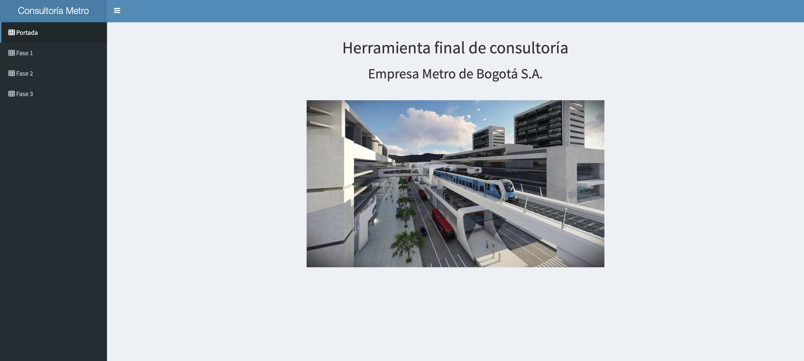
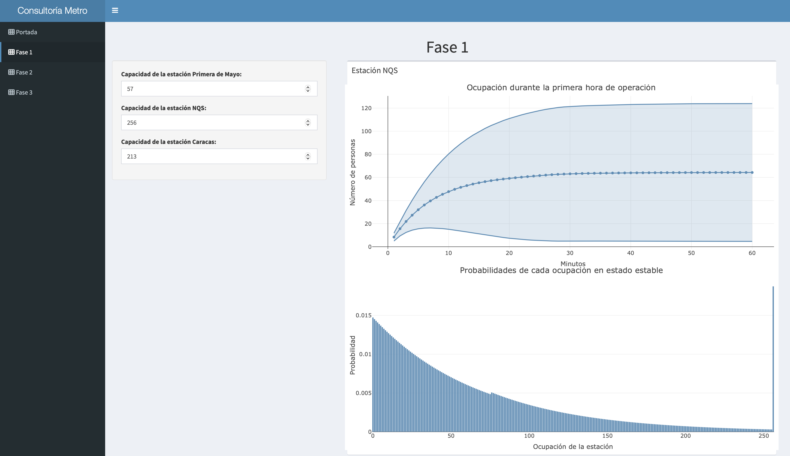
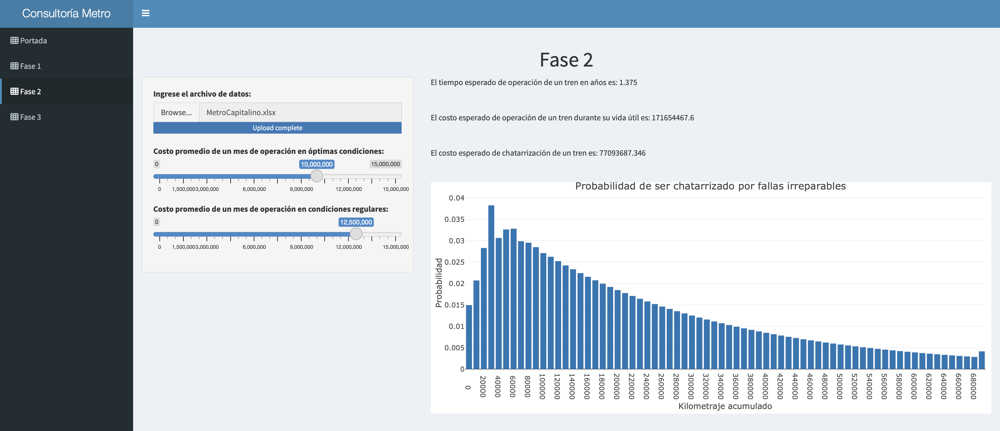
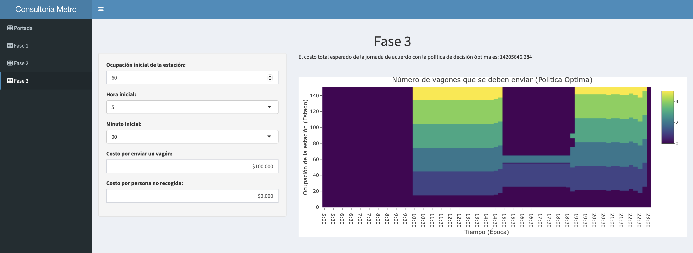

# Metro Bogotá

A Shiny dashboard that models and analyzes Bogotá Metro station operations using Markov chains and stochastic dynamic programming.


This repository contains the final project for the _Stochastic Models_ course at Universidad de los Andes.

## What the app includes

From the code in `src/app.R` and phase modules:

- **Fase 1**: continuous-time Markov chain analysis for station occupancy (expected occupancy, variability bands, and steady-state probabilities) for Primera de Mayo, NQS, and Caracas.
- **Fase 2**: discrete-time Markov chain analysis based on uploaded `.xlsx` data to estimate operation time, operation cost, scrapping cost, and failure-related absorption probabilities by distance.
- **Fase 3**: stochastic dynamic programming policy to choose wagons sent over time, with total expected cost and heatmap of decisions.

## Demo






## Installation

### Option 1: Docker (recommended)

```bash
docker build -t metro-r-image .
docker run --rm -p 3838:3838 metro-r-image
```

Then open `http://localhost:3838/`.

### Option 2: Run locally with R

Install required R packages (same set used in `Dockerfile`):

```r
install.packages(c('plotly', 'markovchain', 'readxl', 'expm', 'shiny', 'shinydashboard', 'shinyWidgets'), repos='http://cran.rstudio.com')
```

Run the app from the repository root:

```bash
cd src
R -f app.R
```

The app is configured to run on host `0.0.0.0` and port `3838`.

## Project structure

```text
.
├── src/
│   ├── app.R          # Shiny UI/server and app entry point
│   ├── Fase_1.R       # CTMC model + statistics for station occupancy
│   ├── Fase_2.R       # DTMC model + lifecycle/cost calculations
│   ├── Fase_3.R       # SDP model + optimal decision policy
│   └── www/
│       └── image.jpeg # Cover image used in dashboard
├── assets/
│   └── MetroCapitalino.xlsx # Example data asset for phase-2 style input
├── Dockerfile         # Containerized runtime for the dashboard
├── LICENSE            # MIT License
└── README.md
```

## GitHub Pages

A static project page is provided in `docs/` and can be deployed automatically with GitHub Actions (`.github/workflows/pages.yml`).

## License

This project is licensed under the MIT License. See [LICENSE](LICENSE).
